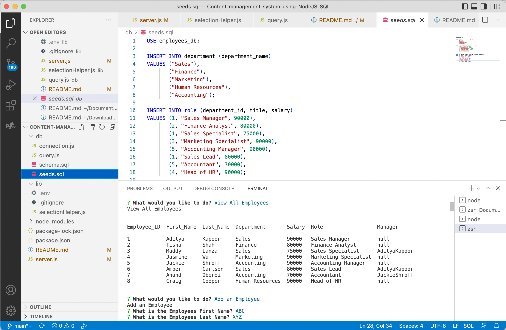
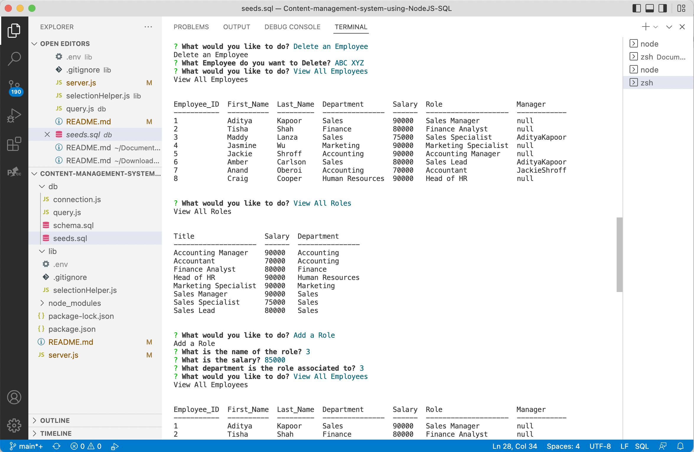
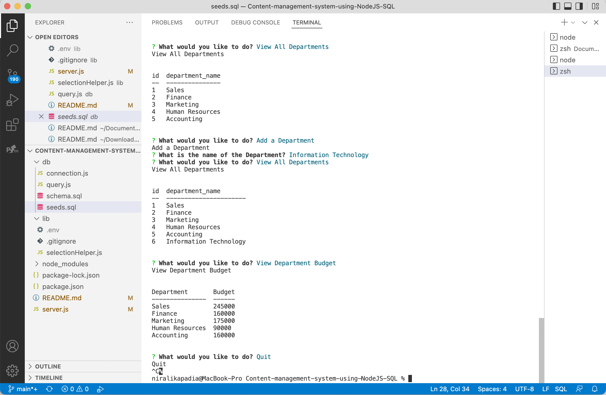
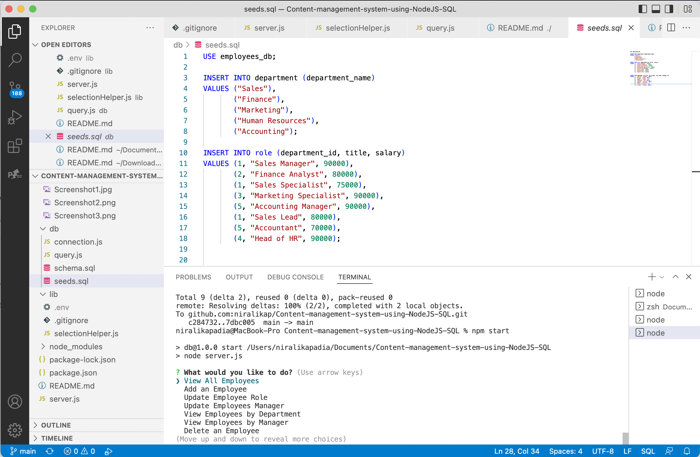

# Content-management-system-using-NodeJS-SQL

# 12 SQL: Employee Tracker

## User Story

```md
AS A business owner
I WANT to be able to view and manage the departments, roles, and employees in my company
SO THAT I can organize and plan my business
```

## Description

In this assignment, I have used Node.js, Inquirer, and MySQL to build a command-line application from scratch to manage a company's employee database. The application will be invoked by using the following command:

- Use npm install to install the node modules.
- Use .gitignore file for security and space reasons.
- Use npm start to invoke the application.

The application does the following:

- It is a command-line application that accepts user input.

- When I start the application, then I am presented with the following options: view all departments, view all roles, view all employees, add a department, add a role, add an employee, and update an employee role.

- When I choose to view all departments, then I am presented with a formatted table showing department names and department ids.

- When I choose to view all roles, then I am presented with the job title, role id, the department that role belongs to, and the salary for that role.

- When I choose to view all employees, then I am presented with a formatted table showing employee data, including employee ids, first names, last names, job titles, departments, salaries, and managers that the employees report to.

- When I choose to add a department, then I am prompted to enter the name of the department and that department is added to the database.

- When I choose to add a role, then I am prompted to enter the name, salary, and department for the role and that role is added to the database.

- When I choose to add an employee, then I am prompted to enter the employee’s first name, last name, role, and manager, and that employee is added to the database.

- When I choose to update an employee role, then I am prompted to select an employee to update and their new role and this information is updated in the database. 

- The application also does the following bonus queries:
* Update employee managers.

* View employees by manager.

* View employees by department.

* Delete departments, roles, and employees.

* View the total utilized budget of a department&mdash;in other words, the combined salaries of all employees in that department.





